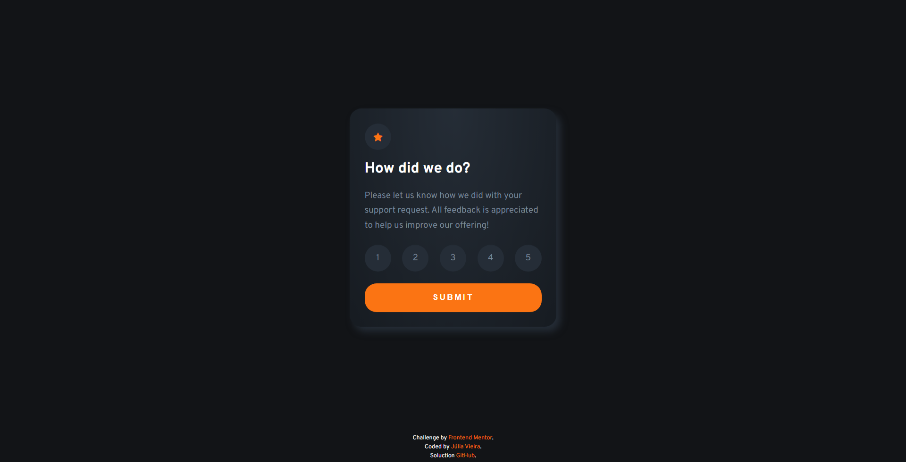

# Frontend Mentor - Interactive rating component solution

This is a solution to the [Interactive rating component challenge on Frontend Mentor](https://www.frontendmentor.io/challenges/interactive-rating-component-koxpeBUmI). Frontend Mentor challenges help you improve your coding skills by building realistic projects. 

## Table of contents

- [Overview](#overview)
  - [The challenge](#the-challenge)
  - [Screenshot](#screenshot)
  - [Links](#links)
- [My process](#my-process)
  - [Built with](#built-with)
  - [What I learned](#what-i-learned)
  - [Useful resources](#useful-resources)
- [Author](#author)

## Overview

### The challenge

Users should be able to:

- View the optimal layout for the app depending on their device's screen size
- See hover states for all interactive elements on the page
- Select and submit a number rating
- See the "Thank you" card state after submitting a rating

### Screenshot



### Links

- Challenge URL: [Front End Mentor](https://www.frontendmentor.io/challenges/interactive-rating-component-koxpeBUmI)
- Solution URL: [Solution](https://github.com/Lia-Moon/Interactive-rating-component) ** **This brings you back to this Github page**
- Live Site URL: [Live site](https://interactive-rating-component-two-olive.vercel.app/)

## My process

### Built with

- Semantic HTML5 markup
- CSS custom properties
- Flexbox
- [Bootstrap Icons](https://icons.getbootstrap.com/) - For icons

### What I learned

I enjoyed practicing JavaScript, reinforcing some and learning new ones.

Examples:
```js
switch (option) {
        case 'opt1':
            opt1.classList.add('changeButtonColor');
            break;
}
```
```js
opt2.classList.contains('changeButtonColor');
```
```js
ratingSelected.textContent = '1';
```

### Useful resources

- [W3 Schools](https://www.w3schools.com/css/default.asp) - This website is super helpful with all the documentation.

## Author

- Website - [Júlia Vieira](https://juliavieira.xyz/)
- Frontend Mentor - [@Lia-Moon](https://www.frontendmentor.io/profile/Lia-Moon)
- Github - [@Lia-Moon](https://github.com/Lia-Moon)